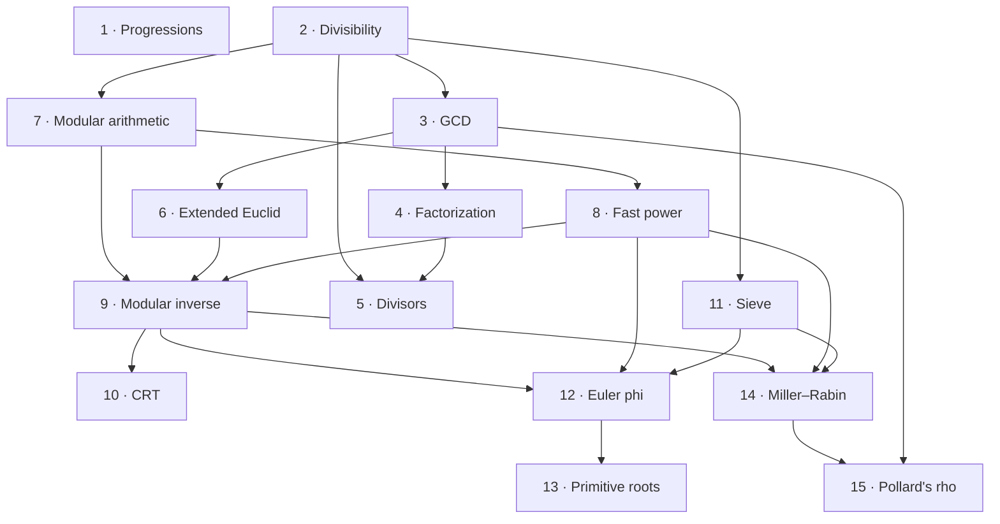

# Number Theory

> A practical Number Theory knowledge base for Competitive Programming.

[](concepts/)
[](problems/)
[](https://github.com/baraafanah21/NumberTheory/commits/main)
[](LICENSE)

```text
┌─────────────────────────────────────┐
│ Concepts → Patterns → Problems      │
│ Theory   → Practice → Improvement   │
└─────────────────────────────────────┘
```

I spent a lot of time jumping between books and resources. This is the condensed path I
wish I had: one concept at a time, each one small, proved properly, and paired with the
code that actually gets used in contests. The extra detail is there if you want it and
safe to skip if you don't.

## Contents

- [Roadmap](#roadmap)
- [Concepts](#concepts)
- [Explore the repository](#explore-the-repository)
- [What is in each concept folder](#what-is-in-each-concept-folder)
- [Conventions](#conventions)
- [License](#license)

## Roadmap

**Read the concepts in this order.** Each one uses only the ones before it. An arrow
means "is needed by", taken from the **Needs** line at the top of each concept.



- **Progressions (1)** are closed forms and don't depend on anything else.
- **The gcd track and the modular track meet at 9, the modular inverse.** Extended
  Euclid (6) finds it for any modulus. Fast power (8) finds it for a prime modulus.
- **Euler phi (12)** combines three earlier tools: the sieve, fast power and the
  inverse. Primitive roots (13) build on it.
- **Which prime tool?** For many numbers below $10^7$, use the **sieve** (11). For one
  number up to $10^{18}$, use **Miller–Rabin** (14). To get its **factors**, use
  **Pollard's rho** (15), which calls Miller–Rabin to know when to stop splitting.
- Concept 3 proves **Euclid's lemma**, which is what makes concept 4 true. Concept 4 in
  turn is what makes the formulas in 5 and 12 well defined.

## Concepts

| #   | Concept                                                          | What you get from it                              |
| --- | ---------------------------------------------------------------- | ------------------------------------------------- |
| 1   | [Progressions](concepts/progressions/)                           | summing a sequence without looping                |
| 2   | [Divisibility](concepts/divisibility/)                           | divisors in $O(\sqrt n)$, sieves, digit tests     |
| 3   | [GCD and the Euclidean algorithm](concepts/gcd/)                 | gcd, lcm, coprimality, reachability               |
| 4   | [Unique factorization](concepts/prime-factorization/)            | why prime factorization is _the_ factorization    |
| 5   | [Divisors](concepts/divisors/)                                   | enumerate and count divisors                      |
| 6   | [Extended Euclidean algorithm](concepts/extended-euclid/)        | Bézout coefficients, $ax+by=c$, CRT               |
| 7   | [Modular arithmetic](concepts/modular-arithmetic/)               | congruences, normalization, safe operations       |
| 8   | [Fast power](concepts/fast-power/)                               | computing $a^b \bmod m$ in $O(\log b)$            |
| 9   | [Modular multiplicative inverse](concepts/modular-inverse/)      | dividing under a modulus, $\binom{n}{k} \bmod p$  |
| 10  | [Chinese remainder theorem](concepts/chinese-remainder-theorem/) | combining congruences, splitting a computation    |
| 11  | [Sieve of Eratosthenes](concepts/sieve/)                         | all primes up to $n$, fast factorization          |
| 12  | [Euler's totient function](concepts/euler-phi/)                  | inverses for any modulus, huge exponents          |
| 13  | [Primitive roots and discrete log](concepts/primitive-roots/)    | cycle lengths, generators, solving $g^x \equiv b$ |
| 14  | [Miller–Rabin primality test](concepts/miller-rabin/)            | is _this_ number prime, for $n$ up to $10^{18}$   |
| 15  | [Pollard's rho factorization](concepts/pollard-rho/)             | the _factors_ of one number, in $O(n^{1/4})$      |

## Explore the repository

After the concepts, use these sections:

|     | Section                                  | Use it when                                          |
| --- | ---------------------------------------- | ---------------------------------------------------- |
| 📚  | [Concepts](concepts/)                    | you want to learn a tool and why it works            |
| 🗺️  | [Connections](connections/README.md)     | you want to see how the tools fit together           |
| 🧠  | [Patterns](patterns/README.md)           | you have a problem statement and need to pick a tool |
| ⚡  | [Templates](templates/README.md)         | you need contest-ready code to paste                 |
| 🏆  | [Problems](problems/README.md)           | you want practice, sorted by rating                  |
| 🐛  | [Mistakes](mistakes/README.md)           | an answer is wrong and you don't know why            |
| 📋  | [Cheatsheet](cheatsheet/README.md)       | you need a quick reference before a contest          |

## What is in each concept folder

- **`README.md`**: the idea in plain language, the formulas with every symbol named, the
  one or two algorithms you actually implement, and the mistakes that cost you.
- **`proofs.md`**: why each formula is true. Every proof states the claim, explains it in
  words, proves it, then says which line of code it justifies.
- **`implementation.cpp`**: only the functions that matter, with their complexities, plus
  a demo that checks itself.
- **`problems.md`**: ten problems, solved by hand, then in code, then harder versions,
  with worked answers. Every check value in them was computed, so a mismatch means a bug
  in your code. Each file ends with a table of **Codeforces and LeetCode problems** that
  drill the same idea.

## Conventions

- Maths is written in LaTeX, so it renders on GitHub and in the VS Code preview
  (`Ctrl+Shift+V`).
- When a concept uses a result it doesn't prove, it says so and links to where it _is_
  proved.
- Every `implementation.cpp` compiles cleanly under `g++ -std=c++17 -Wall -Wextra`, and
  its demo checks its own output against brute force.
- Folders and files are named in `kebab-case`.

```sh
g++ -std=c++17 -O2 -o demo concepts/divisibility/implementation.cpp && ./demo
```

## License

[MIT](LICENSE). Use it, copy it, learn from it.
